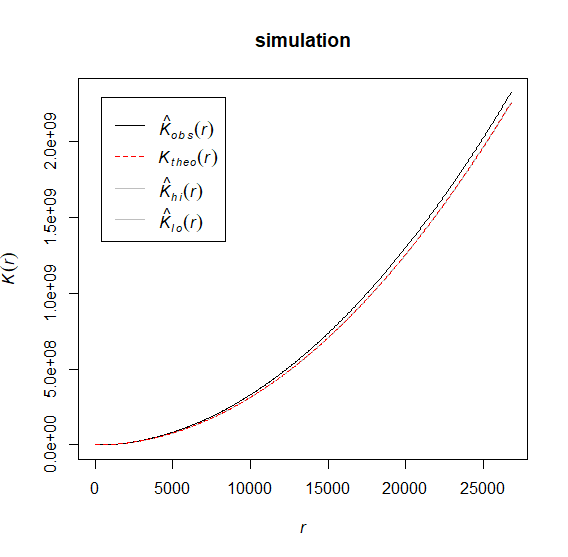

This is the report for the sixth assignment "Work with your own point pattern data" from course "Analysis of Spatio-Temporal Data", WS 2018/19.  
Supervisor: prof. Edzer Pebesma

```{r setup, include=FALSE}

library(sp)
library(spatstat)
library(gstat)
library(rgdal)

```
  
****************


## Explain in less than 50 words what a spatial point pattern is, what it is composed of, and which questions we tend to ask to point pattern data.
A ’spatial point pattern’ is a dataset composed ot the particular events in their exact locations (e. g. trees in a forest), where these locations were created naturally. We tend to look for any kind of reguralities in the spatial distribution of the point pattern.


## Look for a point pattern dataset on a topic that interests you.
I would like to analyze the point dataset representing location of cities in Poland in the Mazovian Voivodeship. Data were obtained as a shapefile from National Register of Geographical Names (PRNG):
http://www.gugik.gov.pl/pzgik/dane-bez-oplat/dane-z-panstwowego-rejestru-nazw-geograficznych-prng
  Data was updated 5th Oct 2018. Data was accessed 2nd Dec 2018.

## Try to verify whether the point pattern is completely spatial random, or whether points attract each other, or repulse each other.
```{r} 
# Read the data
p_df <- read.csv2("mazowieckie.csv",
                header=TRUE,
                quote="\"",
                stringsAsFactors = FALSE,
                strip.white = TRUE)
pointPattern <- p_df
pointPattern$Latitude<- as.numeric(as.character(p_df$wsp_pro_Y))
pointPattern$Longitude<- as.numeric(as.character(p_df$wsp_pro_X))
coordinates(pointPattern)<-~Longitude+Latitude
proj4string(pointPattern) <- CRS("+init=epsg:2180")

# Sum up
summary(pointPattern)

# Plot
plot(pointPattern, cex=1)

```
```
                
## Compute a density map of the point pattern.
```{r}
# Define the observation window
## Load in the voivodeship boundry nodes dataframe
b_df <- read.csv2("my_boundary.csv",
                header=TRUE,
                quote="\"",
                stringsAsFactors = FALSE,
                strip.white = TRUE)
## Drop ID column
b_df$my_id <- NULL


myWindow = owin(poly=list(x=b_df$Lon,y=b_df$Lat))

# Create a planar point pattern
myPPP = ppp(as.numeric(as.character(p_df$wsp_pro_X)), as.numeric(as.character(p_df$wsp_pro_Y)), window = myWindow) 
plot(myPPP)
d <- density.ppp(myPPP,sigma = bw.ppl(myPPP))
plot(d)

# Run Kest simulation
# simulation <- envelope(myPPP, Kest, 10) <== ~2 hours
# plot(simulation)

```

  Might suggest completely random (Poisson) point process.
  

## What is the unit of measurement of the values shown in this density map?
It's the number of points around a given location divided by the given area. The unit being used here is [1/m2].
